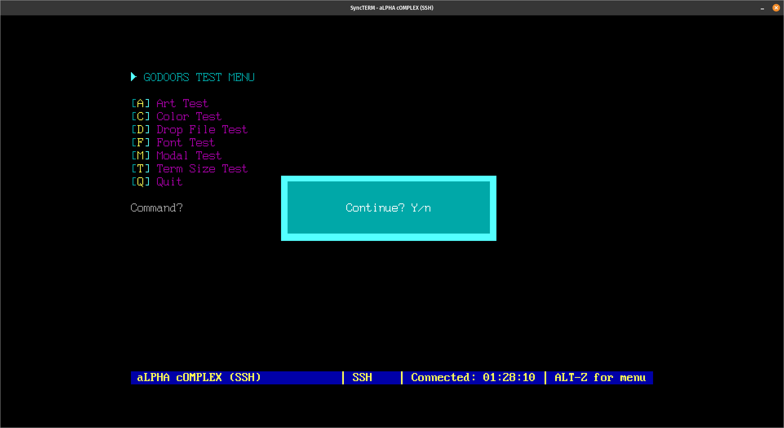

# :computer: GoDoors

Helpful library for creating linux-based door applications (like games and utilities) for BBSs that utilize STDIN and STDOUT, when connected over a terminal program like [SyncTerm](https://syncterm.bbsdev.net/), [MagiTerm](https://gitlab.com/magickabbs/MagiTerm), [NetRunner](http://mysticbbs.com/downloads.html) or [IGTerm](https://www.phenomprod.com/).

If you're not already running linux-based BBS software like [Talisman](https://talismanbbs.com/), [Mystic](http://mysticbbs.com/downloads.html), [Synchronet](https://wiki.synchro.net/install:nix), [ENiGMA½](https://enigma-bbs.github.io/) or [WWIV](https://github.com/wwivbbs/wwiv), then this library probably isn't for you.

----
 
> :point_up: Screenshot of [example](https://github.com/robbiew/godoors-example) program to test some of the functions

## INSTALL
```go
go get github.com/robbiew/godoors
```

## USAGE
```go
import (
    gd "github.com/robbiew/godoors"
)
```


## DROP FILES

```go
gd.DropFileData(path string) (alias string, timeLeft, emulation, node int, err error)
```

> :point_up: Pass the path of the folder **containing** a [door32.sys](https://raw.githubusercontent.com/NuSkooler/ansi-bbs/master/docs/dropfile_formats/door32_sys.txt) drop file (a trailing slash is optional). It returns HANDLE/ALIAS, TIME LEFT (in minutes), EMULATION TYPE (0 = ASCII, 1 = ANSI), NODE NUMBER, and an `error`. The filename is matched case-insensitively (`door32.sys`, `DOOR32.SYS`, `Door32.Sys`). Only door32.sys is supported at this time.

```go
alias, timeLeft, emulation, node, err := gd.DropFileData("./")
if err != nil {
    log.Fatal(err)
}
```

## INITIALIZE

```go
gd.Initialize(path string) (gd.User, error)
```

> :point_up: Convenience wrapper: reads the drop file **and** probes the terminal size in one call, returning a populated `User` (Alias, TimeLeft, Emulation, NodeNum, H, W, ModalH, ModalW). Returns an `error` if the drop file can't be read or parsed.

***
 
## GET TERMINAL HEIGHT AND WIDTH
```go
gd.GetTermSize() (int, int)
```

> :point_up: Tries to detect the user's terminal size. Returns HEIGHT and WIDTH. If it can't detect it, it'll default to 25 and 80.

***
## DISPLAY ANSI ART
```go
gd.PrintAnsi(art string, delay int, height int)
```

> :point_up: Pass the **contents** of an ANSI art file (e.g. `b, _ := os.ReadFile(path); gd.PrintAnsi(string(b), 40, u.H)`). It strips the SAUCE metadata trailer, then prints line by line up to `height` lines, with an optional `delay` in milliseconds (e.g. 40) to simulate slower speeds. `PrintAnsiLoc`, `AbsCenterArt` and `Modal` likewise take art contents, not a path.

```go

var (
	gd.Heart        
	gd.ArrowUpDown  
	gd.ArrowUp      
	gd.ArrowDown   
	gd.ArrowDownFat 
	gd.ArrowRight  
	gd.ArrowLeft    
	gd.Block       
)
```
> :point_up: Variables for printing individual CP437 symbols on the fly, e.g. fmt.Println(SYMBOL) or whatever. (TO-DO: add more!)

***
## DISPLAY SOMETHING AT X,Y COORDINATES
```go
gd.PrintAnsiLoc(file string, x int, y int)
gd.PrintStringLoc(text string, x int, y int)
```

> :point_up: Same as above, only it'll print the art to the screen at X,Y coordinates, incrementing the Y position after every line. Handy of you need to update the screen with art in a particular location without clearing and re-writing everything.

***
## PAUSE
```go
gd.Pause()
```

> :point_up: Hit any key 

***
## CONTINUE Y/N PROMPT
```go
gd.Continue() bool
```

> :point_up: Reads one key: `Y`/`y`/Enter return `true`, `N`/`n`/Esc return `false`, and any other key re-prompts. Respects the idle timeout (`gd.Idle`).

***
## POP UP STYLE MODAL
```go
u, _ := gd.Initialize("./")
u.Modal(art string, text string, l int)
```

> :point_up: Displays background ANSI art (contents, not a path) centered on screen with `text` (of display length `l`) and a "Continue? Y/n" prompt. It's a method on the `User` returned by `gd.Initialize`, so it's sized to that session's terminal.

***

## CENTER SOMETHING (text, art, etc.)
```go
u, _ := gd.Initialize("./")
u.AbsCenterText(s string, l int, c string) // method on User
u.AbsCenterArt(art string, l int)          // method on User
gd.CenterText(s string, w int)             // package function
```
> :point_up: "absolute center" being both vertically and horizontally centered based on the terminal height and width. `AbsCenterText`/`AbsCenterArt` are methods on the `User` from `gd.Initialize`, so they use that session's dimensions. `s`/`art` display length is `l`; `c` is a background color constant. `AbsCenterArt` takes art contents, not a path.

***

## Cursor related

```go
// Move the cursor n cells to up.
gd.CursorUp(n int) 

// Move the cursor n cells to down.
gd.CursorDown(n int) 

// Move the cursor n cells to right.
gd.CursorForward(n int) 

// Move the cursor n cells to left.
gd.CursorBack(n int) 

// Move cursor to beginning of the line n lines down.
gd.CursorNextLine(n int) 

// Move cursor to beginning of the line n lines up.
gd.CursorPreviousLine(n int) 

// Move cursor horizontally to x.
gd.CursorHorizontalAbsolute(x int) 

// Show the cursor.
gd.CursorShow() 

// Hide the cursor.
gd.CursorHide()
```
***
## Color
```go
// Text colors supported by BBS term programs
// usage: fmt.Println(gd.Yellow)
gd.Black         
gd.Red          
gd.Green         
gd.Yellow     
gd.Blue        
gd.Magenta      
gd.Cyan         
gd.White         
gd.BlackHi   
gd.RedHi      
gd.GreenHi     
gd.YellowHi    
gd.BlueHi      
gd.MagentaHi   
gd.CyanHi     
gd.WhiteHi     

// Background colors
gd.BgBlack        
gd.BgRed          
gd.BgGreen        
gd.BgYellow       
gd.BgBlue          
gd.BgMagenta       
gd.BgCyan          
gd.BgWhite         
gd.BgBlackHi     
gd.BgRedHi       
gd.BgGreenHi     
gd.BgYellowHi   
gd.BgBlueHi     
gd.BgMagentaHi   
gd.BgCyanHi      
gd.BgWhiteHi     

// Reset to default colors
gd.Reset 
```
***
## FONTS
```go
// Supported by SyncTerm
// usage: fmt.Println(gd.Topaz)
gd.Mosoul        
gd.Potnoodle     
gd.Microknight    
gd.Microknightplus 
gd.Topaz          
gd.Topazplus      
gd.Ibm 
gd.Ibmthin         
```

***

## IDLE TIMER
```go
gd.Idle = 120 // seconds; 0 disables the timeout
```
> :point_up: Set the package-level `gd.Idle` (in seconds) before calling `gd.Pause`/`gd.Continue`. When the user idles at a prompt longer than this, the door prints a message and exits. Leave it at `0` to disable — the timer is only armed when `gd.Idle > 0`.

## MISC
See [godoors.go](godoors.go) for other misc. functions.

## :clipboard: TO-DO
- ~~Time-out if no key press in X mins~~
- ~~Pop-up style window~~
- ~~Pause sequence (press any key to continue)~~
- ~~Confirm Y/n prompt~~
- ~~Get single key press from keyboard~~
- Get text input, max X characters
- ~~Idle/timeout timer example~~
- Write user data to text file
- Create a leader or score board
- Write user data to sqlite file
- Retrive/parse/display JSON data from the Internet APIs (16 colors, news, weather, etc.)
- Retrieve an ANSI file from the internet and display
- Add entry to end of log file
- Tidy on exit
- Save & Restore cursor position
- Create a scrollable/selectable list of things
- ANSI art file manipulation (scroll up/down, left/right)
- SIXEL support!
